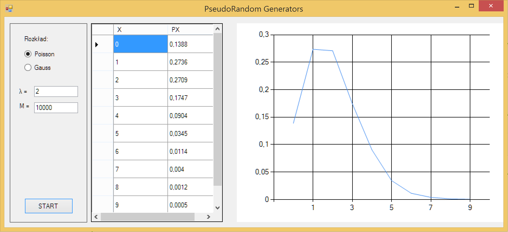
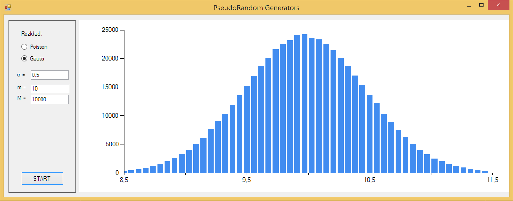

PseudorandomNumberGenerator
===========================

This example program demonstrates pseudorandom number generators usage: Poisson distribution and Normal(Gauss) Distribution

## Poison Distribution

## Gauss (Normal) Distribution

